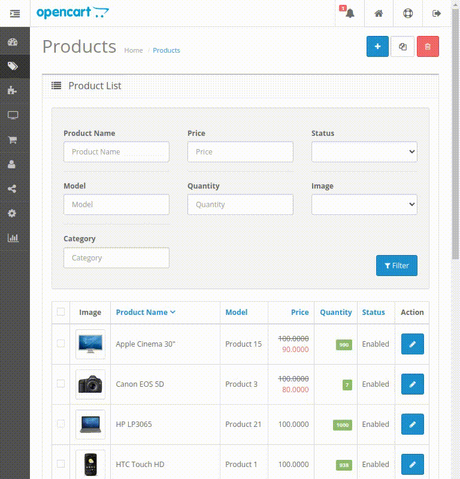
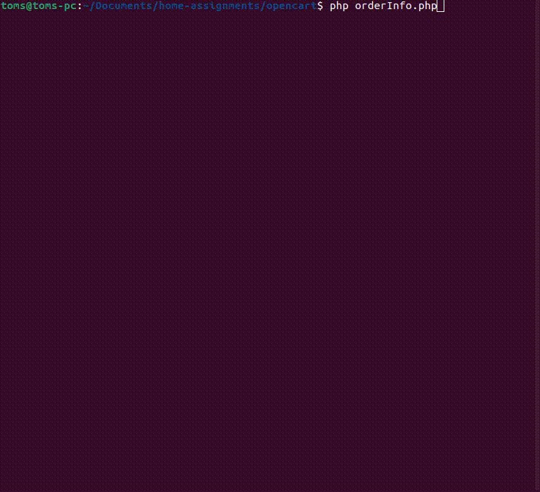

# OpenCart

## Category



## Discount label


## Script



## Technologies used

- PHP 7.4
- mySQL 8.0
- Composer 2.4
- OpenCart 2.3

## Instructions

1. Clone this repository and navigate to its directory by using the commands:
    ```
    https://github.com/tomskoralis/opencart
    cd opencart/
    ```
2. Install the required packages using the command:
    ```
    composer install
    ```
3. Move to the `upload` directory and create the config files by using the commands:
    ```
    cd upload/
    cp config-dist.php config.php
    cp admin/config-dist.php admin/config.php
    ```
4. Start the local development server by using the command:
    ```
    php -S localhost:8000
    ```
5. Install OpenCart by opening the URL http://localhost:8000/ in a browser.
6. Log in as the admin and generate an API key in System > Users > API.
7. Register a new account, place products in the cart and checkout.
8. Open a new terminal window in the `opencart/` directory and use the command to display the order details:
    ```
    php orderinfo.php
    ```
9. Enter the generated API key and the order ID.